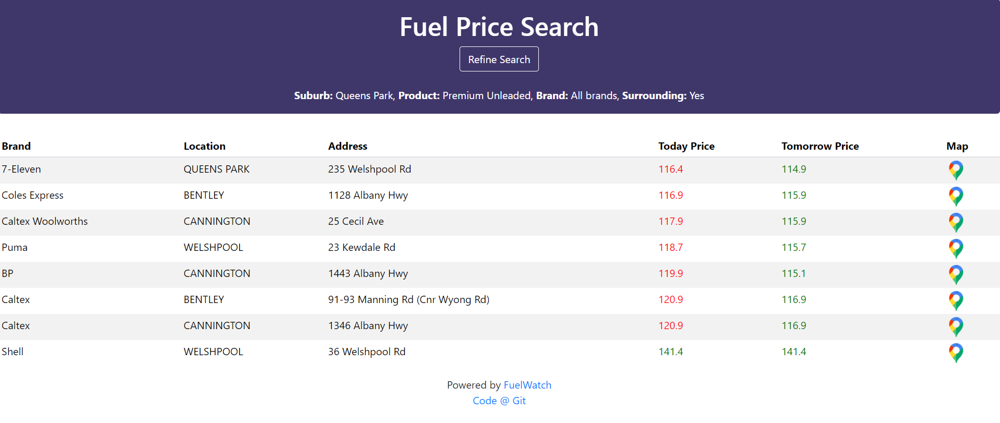

## Fuel Price Comparison - WA

This will help you in getting best deal on fuel price from your surrounding suburbs. Only valid for WA suburbs. This is an beginner application to learn *Python, Flask, Pandas & Heroku*

##### Setup steps

1. Clone repository: `git clone https://github.com/ManjeetJass/Fuel-Comparison`

2. Install dependencies: `pip install -r requirements.txt`

3. Run program: `\fuelprice> python .\wsgi.py`

4. Open 'http://localhost:5000/' in browser to explore application

5. Check working @ https://fuelpricewa.herokuapp.com/

   

##### 

